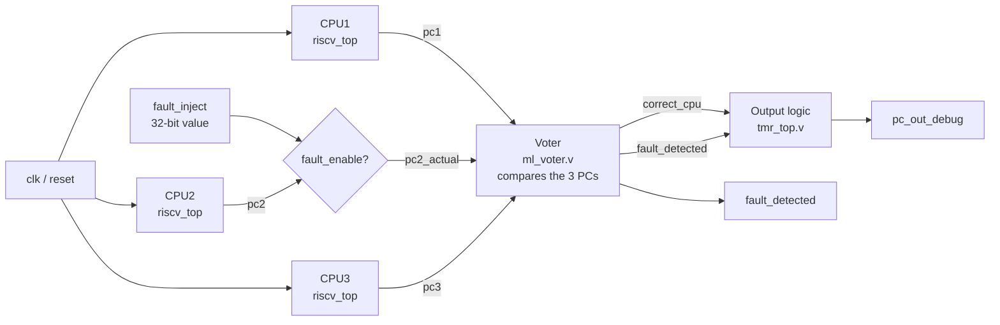
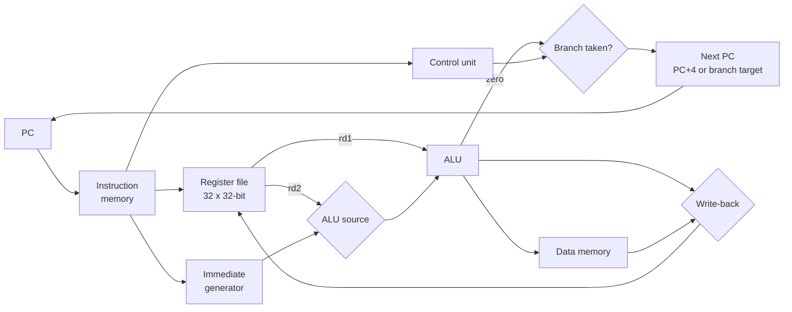
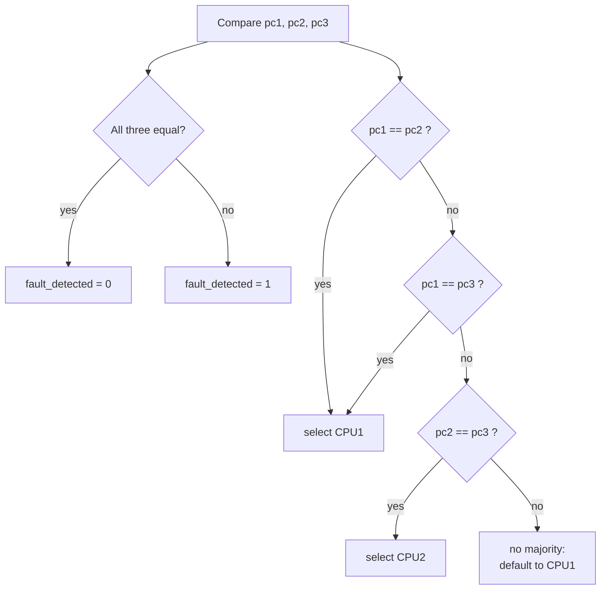
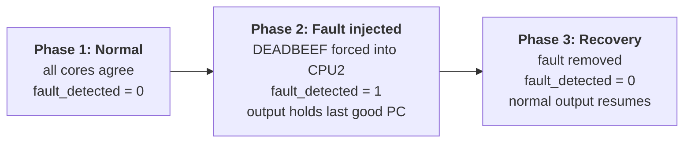
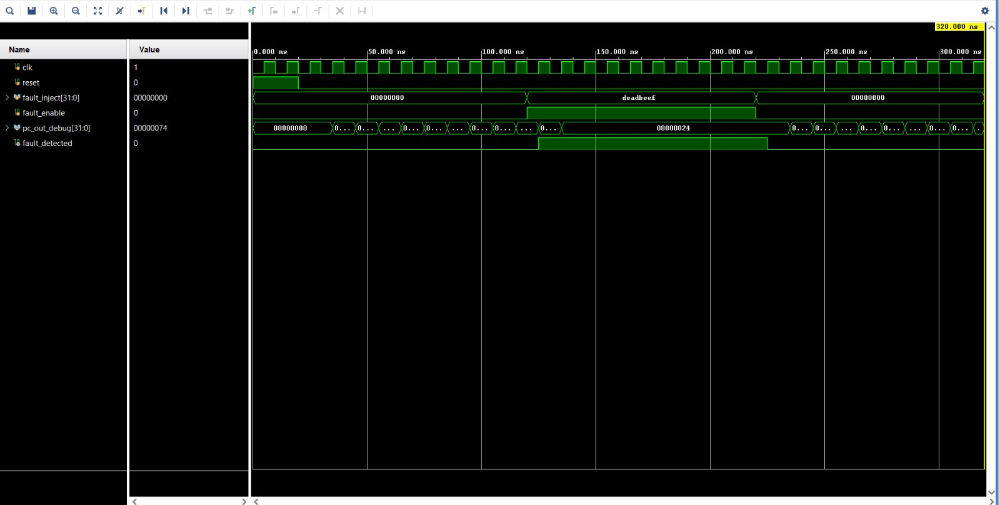
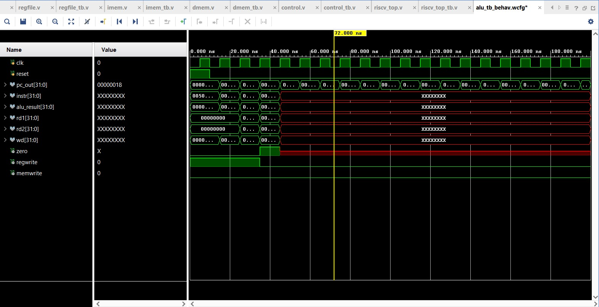
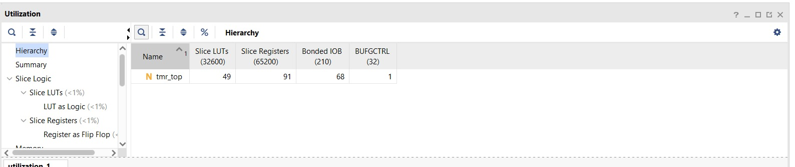
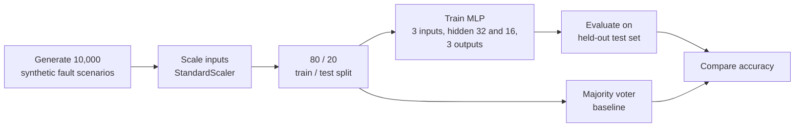

# Fault-Tolerant RISC-V (RV32I subset) TMR System in Verilog


-green)


A **Triple Modular Redundancy (TMR)** system built from three copies of a small single-cycle RISC-V core. It supports fault injection, fault detection and recovery, and was simulated and synthesized in Vivado. A neural-network voter is explored separately as a Python experiment.

> **Status:** the hardware (TMR + voter) is simulated and verified. The neural-network voter is a Python experiment and is **not yet implemented in RTL**. See [Roadmap](#roadmap).

## Table of contents

1. [Why TMR?](#why-tmr)
2. [System architecture](#system-architecture)
3. [Processor core](#processor-core)
4. [How the voter works](#how-the-voter-works)
5. [Fault injection and recovery flow](#fault-injection-and-recovery-flow)
6. [Simulation results](#simulation-results)
7. [FPGA synthesis results](#fpga-synthesis-results)
8. [ML voter experiment (Python)](#ml-voter-experiment-python)
9. [Design flow](#design-flow)
10. [Repository structure](#repository-structure)
11. [How to run](#how-to-run)
12. [Known issues](#known-issues)
13. [Roadmap](#roadmap)

## Why TMR?

In space and defence electronics, radiation can flip bits and corrupt a processor's state. TMR runs **three identical copies** of the logic and compares their outputs, so one faulty copy can be detected and outvoted. This project builds that idea around a small RISC-V core and tests it by injecting faults.

## System architecture

Three cores receive the same clock, reset and program. CPU2's output can be overridden by a fault-injection input, and the voter compares all three program counters (PC).



| Part | File | Description |
|---|---|---|
| Core | `rtl/riscv_top.v` + submodules | Single-cycle RV32I subset |
| TMR top | `rtl/tmr_top.v` | 3 cores, fault-injection mux, output selection |
| Voter | `rtl/ml_voter.v` | Comparator-based voter (see [How the voter works](#how-the-voter-works)) |
| Constraints | `constraints/basys3.xdc` | Basys3 clock, reset and output pins |

## Processor core

A single-cycle datapath: one instruction completes per clock.



**Supported instructions**

| Instruction | Type | Status |
|---|---|---|
| ADD, AND, OR | R-type | Working |
| ADDI | I-type | Working |
| LW | I-type | Working |
| SW | S-type | Partial (immediate format issue, see [Known issues](#known-issues)) |
| BEQ | B-type | Partial (immediate format issue) |
| SUB | R-type | Not working (decoded as ADD) |

The ALU itself implements ADD, SUB, AND, OR, XOR, SLL, SRL, SRA and SLT. The current control logic reaches only some of them.

## How the voter works

The voter compares the three program counters every clock cycle.



- The file is called `ml_voter.v` for historical reasons, but it is a **plain comparator**, not a neural network.
- When `fault_detected = 1`, `tmr_top` holds the **last known good PC** on its output. When all three agree again, normal output resumes.
- If two cores fail with the *same* wrong value, a comparator cannot tell which one is right. This is a known limit of majority voting.

## Fault injection and recovery flow

`fault_enable` and `fault_inject` replace CPU2's PC at the voter input with an arbitrary value (for example `DEADBEEF`) to emulate a fault.



## Simulation results

`tb/tmr_tb.v` runs the three phases above with a 100 MHz clock and checks each result automatically.

| Phase | Stimulus | `fault_detected` | Result |
|---|---|---|---|
| 1. Normal | All cores healthy | 0 | PASS |
| 2. Fault injected | `DEADBEEF` forced into CPU2 | 1 | PASS (output never shows `DEADBEEF`) |
| 3. Recovery | Fault removed | 0 | PASS |



*In the waveform, `fault_detected` rises after `DEADBEEF` is injected, and `pc_out_debug` holds `00000024` until the fault is removed.*

Single-core simulation (PC, instruction, ALU result). The instruction memory holds a 6-instruction test program, so `instr` becomes `X` after it ends:



## FPGA synthesis results

Target: Digilent Basys3 (Artix-7 XC7A35T), synthesis in Vivado.

| Resource | Used | Available |
|---|---|---|
| Slice LUTs | 49 | 32,600 |
| Slice registers | 91 | 65,200 |
| Bonded IOB | 68 | 210 |

Only the PC is brought out of each core, so synthesis removes most unobserved logic. These numbers do **not** represent three complete cores.



More reports are in [`docs/images/`](docs/images) and [`docs/elaborated-design.pdf`](docs/elaborated-design.pdf).

## ML voter experiment (Python)

A separate experiment asks whether a small neural network can pick the correct CPU output, including cases where two CPUs fail and majority voting has no answer.



| Voter | Test accuracy (3 runs, unseeded) | Handles double faults |
|---|---|---|
| Majority voter | about 65 to 67% | No |
| Neural network (MLP) | about 99.9% | Yes, on this data |

**Caveats**

- The data is synthetic.
- In double-fault cases the faulty values are always larger than the correct one, so the network can learn that pattern.
- In those cases the two faulty values also differ, which a majority voter cannot resolve.

Treat this as a proof of concept, not a hardware result.

```bash
cd ml_experiment
pip install scikit-learn numpy joblib
python train_voter.py
```

`extract_weights.py` retrains a smaller network (3,000 samples, hidden 16 and 8) and prints its weights, a first step toward an RTL implementation.

## Design flow


## Repository structure

```
rtl/            Verilog design files (core, TMR top, voter)
tb/             Testbenches (tmr_tb.v is the main one)
constraints/    basys3.xdc
ml_experiment/  train_voter.py, extract_weights.py
docs/           elaborated-design.pdf, images/
release/        riscv_top.bit (bitstream)
```

## How to run

### Option 1: Icarus Verilog (no Vivado needed)

```bash
git clone https://github.com/the-ethereal12/riscv32-fault-tolerant-nn-voter.git
cd riscv32-fault-tolerant-nn-voter
iverilog -g2012 -o tmr_sim rtl/*.v tb/tmr_tb.v
vvp tmr_sim
```

Expected output: four `PASS` lines (no fault, fault detected, voter corrected output, recovery).

### Option 2: Vivado

1. Create a new RTL project for the Artix-7 XC7A35T.
2. Add `rtl/*.v` as design sources, `tb/*.v` as simulation sources and `constraints/basys3.xdc` as constraints.
3. Set `tmr_tb` as the top simulation module.
4. Click **Run Simulation → Run Behavioral Simulation** and watch the three phases in the waveform.

### Option 3: Basys3 board

Program `release/riscv_top.bit` through Vivado Hardware Manager. The constraints use pin W5 for the clock and U18 for reset.

## Known issues

- **SUB is decoded as ADD.** The control logic does not check `funct7`.
- **SW and BEQ use the I-type immediate** instead of the S-type and B-type formats.
- **Faults are injected at the PC signal** at the voter input, not inside the cores.
- **Voter naming:** `ml_voter.v` is a comparator, not a neural network.

## Roadmap

- [x] Single-cycle RV32I subset core
- [x] TMR system with fault injection, detection and recovery
- [x] Automated 3-phase TMR testbench
- [x] Vivado synthesis and utilization reports
- [x] Neural-network voter experiment in Python
- [ ] Fix SUB decode and the S/B-type immediates
- [ ] Self-checking testbench for the core (expected register values)
- [ ] 5-stage pipeline with hazard detection and forwarding
- [ ] Full RV32I base instruction set
- [ ] Fault injection inside registers and pipeline state
- [ ] Implement the trained neural network in Verilog (fixed-point weights)

## Author

Prerna Choudhary ([@the-ethereal12](https://github.com/the-ethereal12)), B.Tech Electronics Engineering (VLSI Design and Technology).
